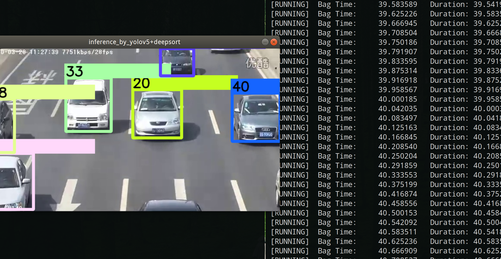

# Yolov5+ros+tensort+deepsort的实现
It is easy to use yolov5+deepsort on ros by tensorrt.


面向github编程的产物，简单整合了一下在ros下的实现
 

* 特别感谢 这个repo tensorRT_Pro:
https://github.com/shouxieai/tensorRT_Pro 
作者乐于分享，善于指导，点赞！

* 有一个测试rosbag放到bag文件夹下了
* deepsort需要调参和加入reid的东西，这个自由发挥了
* 应付一些demo和课程设计足够了

```
rosbag play test.bag
roslaunch cv_detection cv_detection.launch
```